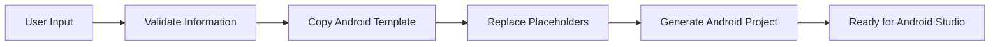

# 🌐 Shiny Website To APK Converter

Convert websites into Android Studio projects with a modern Python desktop application.

---

## 📖 Overview

**Shiny Website To APK Converter** is an open-source Python application that generates Android Studio projects from websites.

Instead of manually creating an Android project, simply enter your website URL, choose an app name, and let the application generate a ready-to-open Android Studio project.

The generated project can then be opened in Android Studio to build an APK.

---

## ✨ Features

- 🌍 Convert online websites into Android projects
- 📁 Support for local HTML websites *(Coming Soon)*
- 📱 Generate Android Studio projects
- 🏷️ Custom application name
- 📦 Custom package name
- 🖼️ Custom application icon *(Coming Soon)*
- 📂 Choose output folder
- 🎨 Modern dark interface
- ⚡ Fast project generation
- 🐍 Built entirely with Python

---

# 📸 Screenshot

> Screenshots will be added after the first public release.

---

# 🏗️ Architecture



---

# 📂 Repository Structure

```text
Shiny-Website-To-APK-Converter/
│
├── main.py
├── gui.py
├── generator.py
├── validator.py
├── utils.py
├── requirements.txt
├── README.md
├── LICENSE
│
├── assets/
├── android_template/
├── output/
└── screenshots/
```

---

# ⚙️ How It Works

1. Launch the application.
2. Enter the website URL.
3. Enter the application name.
4. Enter the Android package name.
5. Choose an output folder.
6. Click **Generate Project**.
7. The program creates a complete Android Studio project.

---

# 🚀 Installation

Clone the repository

```bash
git clone https://github.com/MasterKing67/Shiny-Website-To-APK-Converter.git
```

Open the project

```bash
cd Shiny-Website-To-APK-Converter
```

Install dependencies

```bash
pip install -r requirements.txt
```

Run the application

```bash
python main.py
```

---

# 📋 Requirements

- Python 3.10+
- Windows 10/11

Python Packages

- PySide6
- Pillow
- requests

---

# 🛣️ Roadmap

## Version 0.1

- [x] GUI
- [x] Project Generator
- [x] Validation
- [ ] Android Template
- [ ] ZIP Export

## Version 0.5

- [ ] Custom Icons
- [ ] Splash Screen
- [ ] Local Website Support
- [ ] Offline Assets

## Version 1.0

- [ ] Generate Complete Android Studio Projects
- [ ] APK Export Guide
- [ ] Material Design UI
- [ ] Stable Release

---

# 🤝 Contributing

Contributions are welcome!

1. Fork the repository.
2. Create a feature branch.
3. Commit your changes.
4. Push your branch.
5. Open a Pull Request.

---

# 🐞 Report Issues

Found a bug or have a feature request?

Please open an Issue and include:

- Python version
- Operating System
- Error message
- Steps to reproduce

---

# 📄 License

This project is licensed under the **MIT License**.

See the LICENSE file for details.

---

# 👨‍💻 Author

**Shiny Studios**

Developed with Python.

---

# ⭐ Support

If you like this project:

⭐ Star the repository

🍴 Fork the repository

💬 Share feedback

Every contribution helps improve the project!

---
